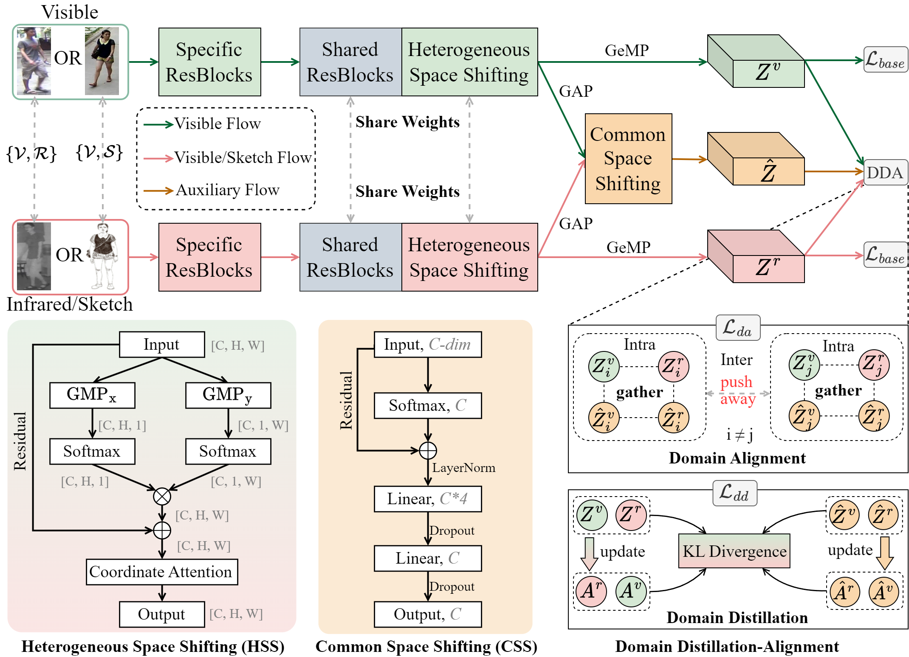
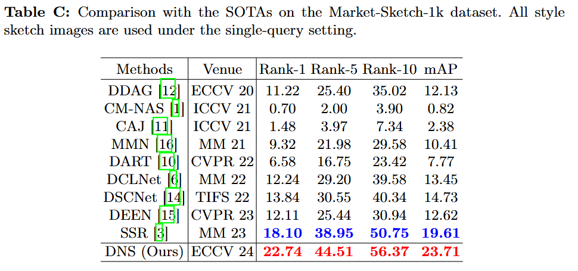

# [ECCV2024] Domain Shifting: A Generalized Solution for Heterogeneous Cross-Modality Person Re-Identification.
## Abstract

Cross-modality person re-identification (ReID) is a challenging task that aims to match cross-modality pedestrian images across multiple camera views. Existing methods are tailored to specific tasks and perform well for visible-infrared or visible-sketch ReID. However, the performance exhibits a notable decline when the same method is utilized for multiple cross-modality ReIDs, limiting its generalization and applicability. To address this issue, we propose a generalized domain shifting method (DNS) for cross-modality ReID, which can address the generalization and perform well in both visible-infrared and visible-sketch modalities. Specifically, we propose the heterogeneous space shifting and common space shifting modules to augment specific and shared representations in heterogeneous space and common space, respectively, thereby regulating the model to learn the consistency between modalities. Further, a domain alignment loss is developed to alleviate the cross-modality discrepancies by aligning the patterns across modalities. In addition, a domain distillation loss is designed to distill identity-invariant knowledge by learning the distribution of different modalities. Extensive experiments on two cross-modality ReID tasks (*i.e.*, visible-infrared ReID, visible-sketch ReID) demonstrate that the proposed method outperforms the state-of-the-art methods by a large margin.

## Pipeline



# Usage

* **Environment**

  ```
  torch >= 2.0.1
  ```

* **Dataset**

  ```
  Dataset/
  ├── SYSU-MM01
  ├── RegDB
  ├── LLCM
  DNS/
  ```

* **Preprocess the SYSU-MM01 and LLCM**

  ```
  python pre_process_sysu.py  # just for faster training
  python pre_process_llcm.py
  ```

* **Training**

  ```
  python train.py --dataset sysu --lr 0.2
  bash train_regdb.sh
  python train.py --dataset llcm --lr 0.2 
  ```

* **Testing**

  You can find the `training log` in [here](./log/) and the `ckpt` in [Google Drive](https://drive.google.com/file/d/18zdq4Ohit84h7khsnLq7MWUoMRQfajp6/view?usp=drive_link).  You can test DNS in [test.ipynb](./test.ipynb) or directly run the following command:

  ```
  # sysu all search
  python test.py --dataset sysu --resume sysu_p6_n4_lr_0.2_seed_0_best.pth --mode all
  
  # sysu indoor search
  python test.py --dataset sysu --resume sysu_p6_n4_lr_0.2_seed_0_best.pth --mode indoor
  
  # regdb infrared to visible
  python test.py --dataset regdb --tvsearch 0
  
  # regdb visible to infrared
  python test.py --dataset regdb --tvsearch 1
  
  # llcm infrared to visible
  python test.py --dataset llcm --resume llcm_p6_n4_lr_0.2_seed_0_best.pth --tvsearch 0
  
  # llcm visible to infrared
  python test.py --dataset llcm --resume llcm_p6_n4_lr_0.2_seed_0_best.pth --tvsearch 1
  ```

* New Tutorial

  I found that setting `args.max_epoch` to 80 has no impact on performance, but it can save 20% of training time. So if you wanna faster training, you can run the following command:

  ```
  python train.py --dataset sysu --lr 0.2 --max_epoch=80
  ```

  Please note that this is optional, and you can also keep in touch with me by setting max_epoch to 100. The corresponding log is provided in [here](./log/sysu_p6_n4_lr_0.2_seed_0_epoch80&150.log).

## Additional Comparison (Market-Sketch-1K Dataset)

Due to my negligence, I did not notice the Market-Sketch-1k (mask1k) dataset during the submission. I discovered this issue when modifying camera-ready and urgently added relevant experiments. I cited this dataset in the camera-ready and added relevant experiments in the supplementary materials. For more information on the mask1k dataset, please refer to [paper](https://arxiv.org/pdf/2309.08372)and [official code](https://github.com/Lin-Kayla/subjectivity-sketch-reid).  Below is the comparison results. More information and corresponding codes can be found in [here](./mask1k/README.md) (`./mask1k/`).




# Acknowledgements

This code is built on [CAJ](https://github.com/mangye16/Cross-Modal-Re-ID-baseline/tree/master/ICCV21_CAJ), [DEEN](https://github.com/ZYK100/LLCM), and [ffcv-imagenet](https://github.com/libffcv/ffcv-imagenet), we thank the authors for opensourcing their code!
