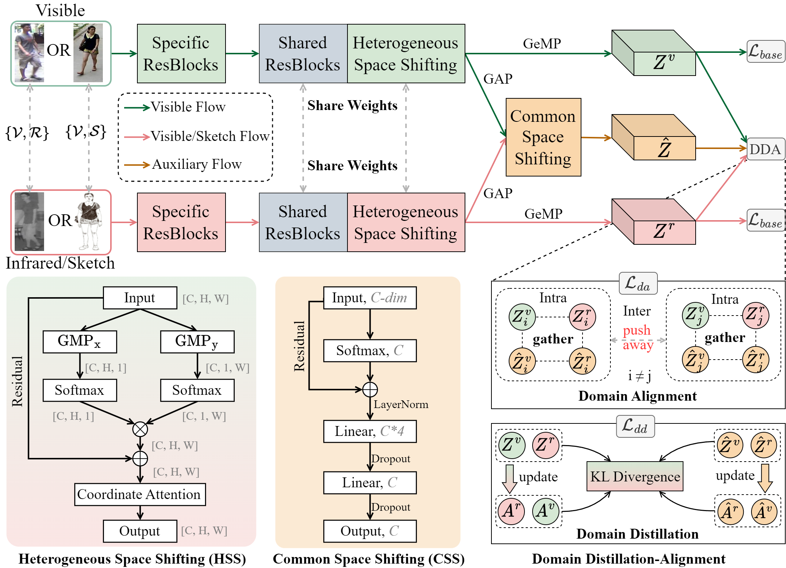
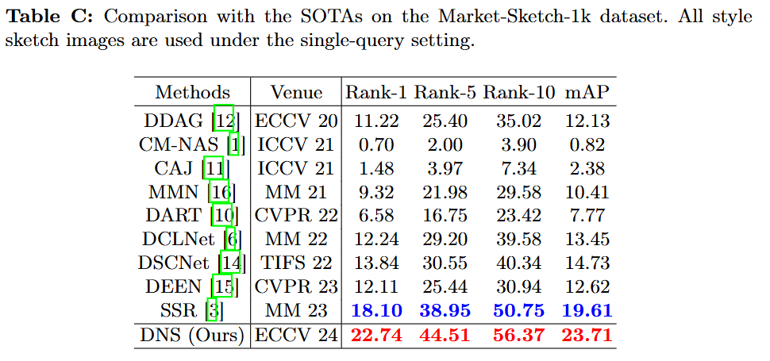

# [ECCV2024] Domain Shifting: A Generalized Solution for Heterogeneous Cross-Modality Person Re-Identification

## Pipeline



## Usage for VS-ReID

* **Dataset**

  **Pku-Sketch:** Please refer to the paper "Cross-domain adversarial feature learning for sketch re-identification". [paper](https://drive.google.com/file/d/1ZTpPSUIOtNKwOZ_DurhOWqMd4lLdOtkF/view). Due to the LA requirement, we cannot provide relevant code, data, and dataset.

  **Market-Sketch-1K:** Please refer to the paper "Beyond Domain Gap: Exploiting Subjectivity in Sketch-Based Person Retrieval". [paper](https://arxiv.org/pdf/2309.08372). [official code](https://github.com/Lin-Kayla/subjectivity-sketch-reid).

* **Preprocess the mask1k dataset**

  ```
  # all style
  python pre_process_mask1k.py --train_style ABCDEF
  
  # single style (I only process the A style)
  python pre_process_mask1k.py --train_style A
  ```

* **Training**

  ```
  # all style
  python train.py --dataset mask1k --lr 0.0009 --optim adamw --train_syle ABCDEF --test_style ABCDEF
  
  # single style (style A)
  python train.py --dataset mask1k --lr 0.0009 --optim adamw --train_syle A --test_style A
  ```

* **Testing**

  You can find the `training log` in [here](./log/mask1k_log/) and the `ckpt` in [Google Drive](https://drive.google.com/file/d/1RLGWy5Q1U_eI0aZ20Zlhs8S4OqLdrTQE/view?usp=sharing) . You can test our DNS in [test.ipynb](./test.ipynb) or directly run the following command:

  ```
  # mask1k all style single query 
  python test.py --train_style ABCDEF --test_style ABCDEF --resume mask1k_styleABCDEF_adamw_p6_n4_lr_0.0009_seed_0_best.pth
  
  # mask1k single(A) style single query
  python test.py --train_style A --test_style A --resume mask1k_styleA_adamw_p6_n4_lr_0.0009_seed_0_best.pth
  ```



* **Tutorial for PKU-Sketch**

  **Split**: The first 150 Identity are used for training, and the rest 50 identity are used for testing.

  **How to run it?** : You can refer to the implementation of RegDB. I provide the evaluation for pku in the [eval_metrics.py](./eval_metrics.py). The single training process on a 2080ti only takes 6 minutes, so training ten times takes about an hour.

  **How to test it?**: Run ten times and take the average value. 


## Contact

jiangyan@nuist.edu.cn
